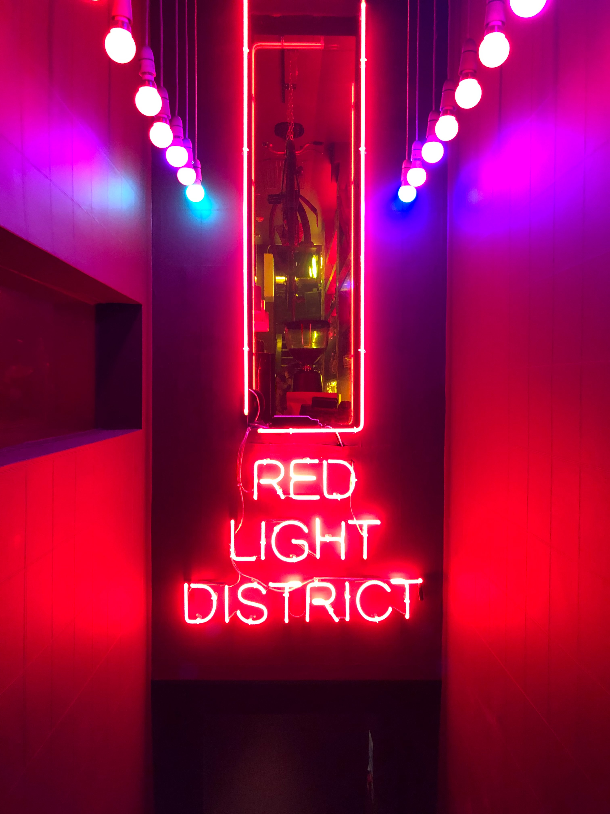

**The trend of neon signs inside and outside business places has spread throughout the world.** From open signs at small corner shops in London to massive signs in Las Vegas, neon lights have flooded our world. The element neon was discovered in 1898 by Sir William and Morris Travers, who were British chemists and found other elements on the periodic table which are used to create neon signs (argon, krypton, xenon). Even though the British discovered the elements it was a French man, Georges Claude, who created the first neon lamp and then displayed it at the Paris Motor Show in 1910. This invention then spread around the globe.

Neon was then most commonly used in American Advertising, it became almost a culture from the 1920s to the 1950s. Photographer, John Barnes, released his book named Neon Road Trip, which contained about 500 pictures he took on his hunt for finding neon signs. Neon signs are evident in America, you can see them at diners, Las Vegas, car washes, drive-ins, and many more. However, this popular culture started falling apart when it became pricey to repair broken signs. It was quite impossible to find even a person that repairs neon signs.

Classic neon lights have a distinguished font that is that each letter looks like it was hand-written and the pen wouldn’t have left the page. Obviously, there are different styles but the natural, joint-handwritten-look is the most common and authentic. The reason is that the light comes from the elements put all together, so if done separately it is more time-consuming and also more expensive because of the separate letters.

Neon lights became popular in marketing because of their artistic and bright characteristics. The luminous signs could be seen from far-stretching distances, which would draw customers in. The variety of colours would allow the designers of the signs to be creative, allowing them to express great art. The signs would look futuristic and eye-pleasing that's why they caught on as a trend so quickly.

These signs are mostly related to nightlife rather than day. You can see this by the type of businesses that acquire such signs. An example would be the Las Vegas strip where most casinos are lit up by these lights and people usually gamble in the night. Another example is the diverse nightlife of the red light district of Amsterdam. The red light district is where legal prostitution takes place and businesses advertise their prostitutes with neon lights all around their properties. The lights here have branded themselves as sexy and attractive, especially the red neon coloured lights.

As we move on into the future we see the artistic style of neon signs remain but replaced with cheaper and more sustainable LED lights. The neon typography lives on but the neon light source dies out.