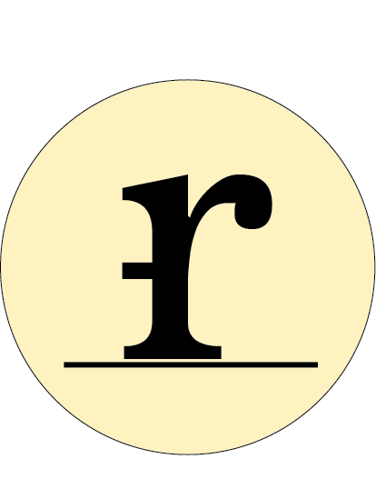

Welcome to the rilikoss media about page!

'rilikoss media' was founded in 2021 by Rilik Osmani. It is designed to be a platform where articles by Rilik can be shared and enjoyed by the rest of the world. The articles are very insightful and educational, allowing the reader to not only entertain themselves while they read but also to be more knowledgeable.

Typography is the main focus on this page and if you are not familiar, you soon will be! We look at the reasons why logos and brands make you feel the way that they do by breaking typography down. This page not only looks at the art of typography but also the elements which are:

* typeface
* font
* consistency
* alignment
* contrast
* colour
* white space
* etc.

The logo created for this page was created on Adobe Indesign. I wanted to combine the letter 'r' and 'm' in a quirky way, whilst still looking sophisticated. The 'r' and 'm' obviously being the initials of the name of the page; the reason they are both lower case instead of capital is to have a unique brand identity that is targeted at youthful adults. In addition, the letters both hover over a line to illustrate the idea of typography in the logo.

When on the page you are introduced by a big, bold, and red-coloured text, 'rilikoss media', over a creative cover page of a collage of ripped-out magazines and examples of typography. The red colour is known for grasping attention, which was the main idea out of the colour choice.